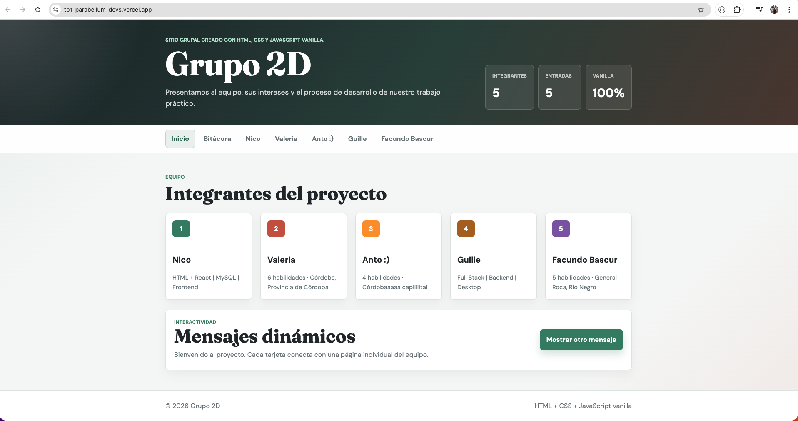
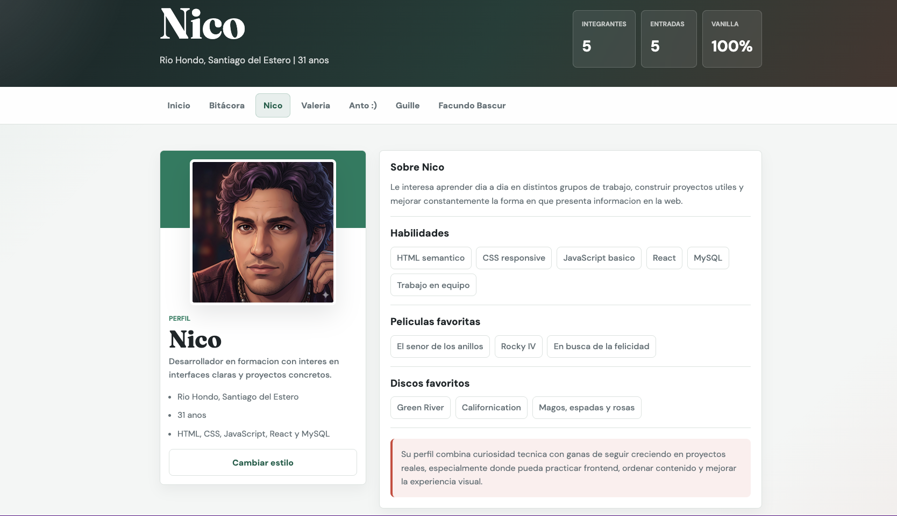
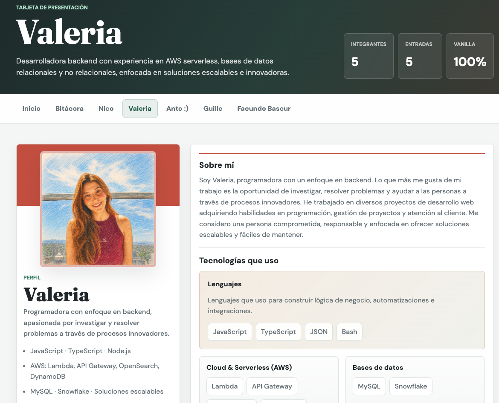
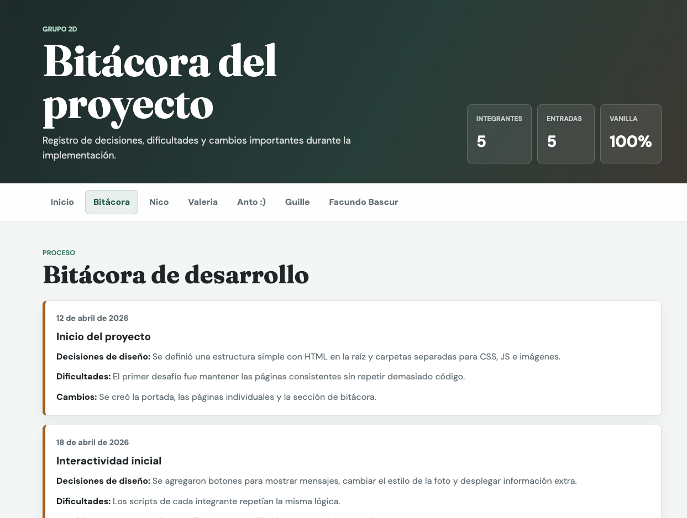
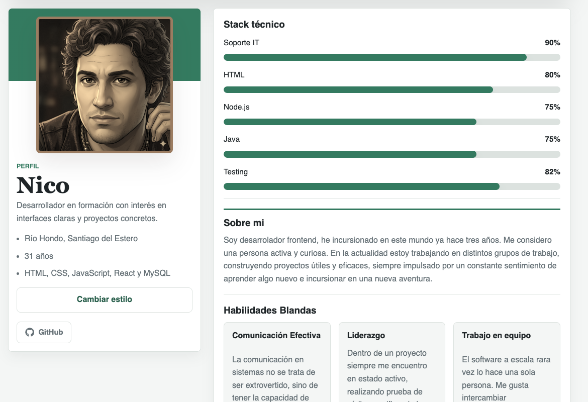
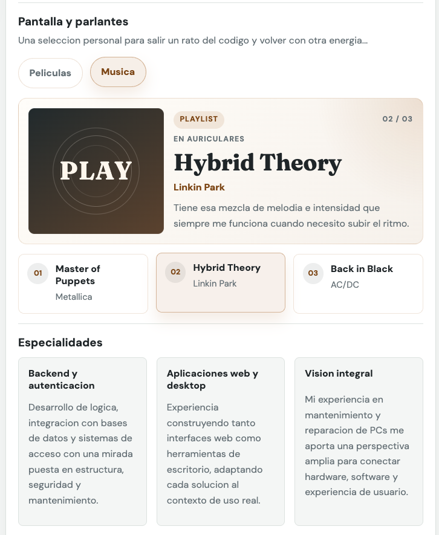

# Grupo 2D - TP2 Frontend React

**Repositorio:** https://github.com/vlmnst/TP2-Front

**Deploy en Vercel:** https://tp-2-front-three.vercel.app/

---

## Descripcion del proyecto

Este proyecto es la version migrada del TP1 hacia una aplicacion moderna con React y Vite. La interfaz mantiene una estetica de dashboard con una `Sidebar` fija, navegacion interna y paginas individuales para cada integrante del equipo.

La app incluye:
- rutas con React Router
- perfiles dinamicos por integrante
- explorador JSON local con busqueda y filtros
- galeria de imagenes con Lightbox y soporte de teclado (`Esc`, flechas)
- consumo de API publica del Museo MET con filtros, paginacion y estados de carga/error
- componentes reutilizables para progreso tecnico, carrusel de proyectos, arbol de renderizado y botones sociales

---

## Integrantes

| Nombre completo   | GitHub                                             |
| ----------------- | -------------------------------------------------- |
| Cristian Nicoletti| [@NicoCris](https://github.com/NicoCris)           |
| Valeria Mansueto  | [@vlmnst](https://github.com/vlmnst)               |
| Antonella Masini  | [@Antocba](https://github.com/Antocba)             |
| Guillermo Novillo | [@guinovi](https://github.com/guinovi)             |
| Facundo Bascur    | [@FacundoBascur](https://github.com/FacundoBascur) |

---

## Tecnologias utilizadas

- React 19
- Vite
- React Router DOM 7
- React Icons
- HTML5
- CSS moderno con variables, grid, flexbox, media queries, animaciones y transiciones
- JavaScript ES Modules
- Fetch API para consumo asincrono
- Vercel para deploy

---

## Caracteristicas implementadas

- **Arquitectura basada en componentes**: layout, sidebar, secciones y paginas reutilizables.
- **Enrutamiento interno**: rutas para Inicio, Arquitectura, Bitacora, Galeria, MET, JSON Explorer y perfiles individuales.
- **Sidebar fija** con logo del equipo, menu jerarquico y listado de integrantes.
- **Pagina Home** con presentacion del equipo y tarjetas de acceso rapido a cada perfil.
- **Perfiles individuales** con datos personales, bio, skills, proyectos y stack tecnico.
- **Seccion de barras de progreso** animadas para skills tecnicos.
- **Carrusel interactivo** en proyectos con controles manuales y posicion actual.
- **Botones sociales** con efectos hover personalizados.
- **Galeria de imagenes** tipo grid.
- **Lightbox** con zoom, navegacion interna y cierre con tecla `Esc`.
- **API publica del MET** con busqueda, filtros por anio, paginacion y modal de detalle.
- **Estados de carga y error** en el consumo de la API.
- **Explorador JSON** con 20 registros, filtros y buscador en tiempo real.
- **Arbol de renderizado** documentado en README y disponible en `/arquitectura`.
- **Bitacora de desarrollo** con entradas de proceso, decisiones y cambios.

---

## Estructura de archivos

```text
/
|-- README.md
|-- consignas-tp2-checklist.md
|-- tareas.md
|-- package.json
|-- package-lock.json
|-- index.html
|-- public/
|   `-- img/
|       |-- iftslogo.png
|       |-- perfiles y recursos visuales
|       `-- readme-capturas/
|           |-- landing.png
|           |-- Bitacora.png
|           |-- Nico-Perfil.png
|           |-- Valeria-perfil1.png
|           |-- Anto-perfil.png
|           |-- Guille-perfil.png
|           `-- Facundo-Perfil.png
`-- src/
    |-- App.jsx
    |-- main.jsx
    |-- router/
    |   `-- index.jsx
    |-- components/
    |   |-- layout/
    |   |   |-- Layout.jsx
    |   |   `-- Sidebar.jsx
    |   |-- JsonMemberCard.jsx
    |   |-- Lightbox.jsx
    |   |-- MemberCard.jsx
    |   |-- MessagePanel.jsx
    |   |-- MetArtworkModal.jsx
    |   |-- Pagination.jsx
    |   |-- ProfileAside.jsx
    |   |-- ProgressBar.jsx
    |   |-- SectionRenderer.jsx
    |   |-- SectionIntro.jsx
    |   |-- SectionList.jsx
    |   |-- SectionProgress.jsx
    |   |-- SectionProjects.jsx
    |   |-- SectionFlip.jsx
    |   |-- SectionFavorites.jsx
    |   |-- SectionFocus.jsx
    |   |-- SectionExtra.jsx
    |   |-- SocialButtons.jsx
    |   `-- TechStack.jsx
    |-- data/
    |   |-- applicant.json
    |   |-- team.js
    |   |-- techIcons.js
    |   `-- techStack.json
    |-- hooks/
    |   `-- useDebounce.js
    |-- pages/
    |   |-- ArchitecturePage.jsx
    |   |-- BitacoraPage.jsx
    |   |-- GalleryPage.jsx
    |   |-- HomePage.jsx
    |   |-- JsonExplorer.jsx
    |   |-- MemberPage.jsx
    |   |-- MetPage.jsx
    |   `-- NotFoundPage.jsx
    `-- styles/
        `-- global.css
```

---

## Guia de estilos

### Paleta de colores

| Uso | Variable CSS | Hex / valor |
| --- | --- | --- |
| Texto principal | `--color-ink` | `#1f2528` |
| Texto secundario | `--color-muted` | `#657076` |
| Fondo general | `--color-paper` | `#f4f6f5` |
| Superficies/tarjetas | `--color-surface` | `#ffffff` |
| Bordes | `--color-line` | `#dce2df` |
| Primario verde | `--color-primary` | `#2f7a5f` |
| Primario oscuro | `--color-primary-dark` | `#235d49` |
| Acento coral | `--color-coral` | `#c4513b` |
| Acento dorado | `--color-gold` | `#a35f16` |

### Tipografias

- **Principal:** `DM Sans` - [Google Fonts](https://fonts.google.com/specimen/DM+Sans)
- **Fallbacks:** `Segoe UI`, `sans-serif`

### Iconografia

- **Libreria:** [React Icons](https://react-icons.github.io/react-icons/)
- **Usos principales:** redes sociales (`FaGithub`, `FaLinkedin`), tecnologias del stack y recursos visuales de secciones.

---

## Funciones dinamicas y componentes clave

| Funcionalidad | Implementacion | Evidencia |
| --- | --- | --- |
| Navegacion SPA | React Router con `RouterProvider`, `Layout`, `Sidebar` y `Outlet`. | Ruta `/arquitectura` y menu lateral. |
| Perfiles dinamicos | `MemberPage` busca cada integrante por `memberId` y renderiza secciones reutilizables. | `src/pages/MemberPage.jsx` |
| Buscador JSON | `JsonExplorer` filtra `applicant.json` con busqueda, rol, skill y debounce. | `src/pages/JsonExplorer.jsx` |
| API externa | `MetPage` consume la API publica del Museo MET con loading, error, filtros y paginacion. | `src/pages/MetPage.jsx` |
| Galeria + Lightbox | `GalleryPage` abre `Lightbox` con zoom, navegacion interna y cierre con `Esc`. | `src/pages/GalleryPage.jsx` |
| Carrusel de proyectos | `SectionProjects` permite recorrer proyectos con controles manuales. | `src/components/SectionProjects.jsx` |
| Arbol de renderizado | `ArchitecturePage` muestra la jerarquia completa de componentes. | Ruta `/arquitectura` |

### Capturas de funcionalidades









---

## Componentes principales

| Componente | Responsabilidad |
| --- | --- |
| `Layout` | Define la estructura general del dashboard: Sidebar, topbar, hero contextual, contenido y footer. |
| `Sidebar` | Organiza la navegacion principal, submenu de integrantes y accesos a exploracion. |
| `MemberCard` | Tarjeta de acceso rapido a cada integrante desde la Home. |
| `ProfileAside` | Panel lateral del perfil con avatar, datos y redes sociales. |
| `SectionRenderer` | Decide que seccion renderizar segun el tipo de dato del perfil. |
| `ProgressBar` | Representa habilidades tecnicas mediante barras animadas. |
| `TechStack` | Muestra tecnologias con iconos y efectos visuales. |
| `Lightbox` | Visualizador modal de imagenes con interaccion por teclado. |
| `Pagination` | Navegacion anterior/siguiente para listados paginados. |
| `MetArtworkModal` | Modal de detalle para obras obtenidas desde la API del MET. |

---

## Evolucion del proyecto

El proyecto comenzo como una estructura estatica de HTML, CSS y JavaScript. En el TP2 se migro hacia React para separar responsabilidades, reutilizar componentes y mantener los datos centralizados.

Cambios principales respecto del TP1:

1. **De paginas estaticas a rutas React:** la navegacion paso a manejarse con React Router.
2. **De HTML repetido a componentes:** perfiles, cards, secciones, botones y modales se transformaron en piezas reutilizables.
3. **De datos hardcodeados a datos centralizados:** integrantes, mensajes, stack y postulantes se organizan en archivos dentro de `src/data`.
4. **De interaccion basica a modulos avanzados:** se agregaron JSON Explorer, API externa, Lightbox, carrusel, barras animadas y arbol de renderizado.
5. **De navegacion simple a dashboard:** la Sidebar fija se volvio el eje estructural de la experiencia.

### Capturas de evolucion






---

## Archivos clave

- `src/components/layout/Layout.jsx` - estructura principal del dashboard.
- `src/components/layout/Sidebar.jsx` - menu lateral con logo, navegacion y submenus de integrantes.
- `src/pages/HomePage.jsx` - portada con la grilla de integrantes.
- `src/pages/MemberPage.jsx` - perfil individual dinamico por ID.
- `src/pages/GalleryPage.jsx` - galeria de imagenes con Lightbox.
- `src/pages/JsonExplorer.jsx` - explorador del JSON local con filtros y busqueda.
- `src/pages/MetPage.jsx` - explorador del MET con busqueda, filtros y paginacion.
- `src/pages/BitacoraPage.jsx` - bitacora de desarrollo.
- `src/pages/ArchitecturePage.jsx` - arbol de renderizado y jerarquia de componentes.
- `src/data/team.js` - datos del equipo, secciones de perfil y configuracion de navegacion.

---

## Arbol de renderizado

El arbol de renderizado muestra como se organiza la aplicacion desde el punto de entrada hasta las paginas y componentes hijos. En este proyecto, `App` es la raiz, `RouterProvider` conecta React Router, `Layout` sostiene la estructura comun, `Sidebar` organiza la navegacion y `Outlet` renderiza la pagina activa segun la URL.

```txt
main.jsx
`-- App
    `-- RouterProvider
        `-- Layout
            |-- Sidebar
            |   |-- Logo del grupo
            |   |-- Navegacion general
            |   |-- Submenu de integrantes
            |   `-- Navegacion de exploracion
            |-- Header / Topbar
            |-- Outlet
            |   |-- HomePage
            |   |   |-- MemberCard
            |   |   `-- MessagePanel
            |   |-- MemberPage
            |   |   |-- ProfileAside
            |   |   |   `-- SocialButtons
            |   |   |-- SectionRenderer
            |   |   |   |-- SectionIntro
            |   |   |   |-- SectionList
            |   |   |   |-- SectionProgress
            |   |   |   |   `-- ProgressBar
            |   |   |   |-- SectionProjects
            |   |   |   |-- SectionFlip
            |   |   |   |-- SectionFavorites
            |   |   |   `-- SectionExtra
            |   |   `-- TechStack
            |   |-- JsonExplorer
            |   |   `-- JsonMemberCard
            |   |-- GalleryPage
            |   |   `-- Lightbox
            |   |-- MetPage
            |   |   |-- Pagination
            |   |   `-- MetArtworkModal
            |   |-- BitacoraPage
            |   `-- NotFoundPage
            `-- Footer
```

La misma informacion tambien esta disponible dentro de la aplicacion en la ruta `/arquitectura`.

---

## Correr localmente

```bash
npm install
npm run dev
```

Para generar la version de produccion:

```bash
npm run build
```

---

## Migracion a React

Este TP2 es la migracion del TP1 hacia una estructura mas modular y mantenible. Se respeto la identidad visual original mientras se aprovecho React para:

- separar logica en componentes reutilizables,
- centralizar datos en `src/data/team.js`,
- resolver la navegacion con React Router,
- manejar estados y efectos con `useState` y `useEffect`,
- mejorar la experiencia del Lightbox y los filtros de busqueda.

---

## Uso de IA

La inteligencia artificial se uso como asistente de trabajo: ayudo a acelerar revisiones, proponer alternativas y detectar problemas, pero las decisiones finales, la seleccion de contenido, la integracion del codigo y la validacion del proyecto fueron realizadas por el equipo.

| Area | Herramienta/modelo | Uso concreto |
| --- | --- | --- |
| Redaccion y documentacion | ChatGPT / Claude Sonnet | Asistencia para ordenar el README, mejorar explicaciones tecnicas, redactar la justificacion de migracion y estructurar el arbol de renderizado. |
| Refactorizacion de componentes | GitHub Copilot / Claude Sonnet | Sugerencias para dividir vistas en componentes reutilizables como `Layout`, `Sidebar`, `SectionRenderer`, `ProgressBar`, `Lightbox` y `Pagination`. |
| Logica React | ChatGPT / Claude Sonnet | Apoyo conceptual para `useState`, `useEffect`, renderizado condicional, manejo de rutas con React Router, filtros en tiempo real y paginacion. |
| Debugging | ChatGPT / Claude Sonnet | Revision de errores de importacion, problemas de rutas, estados de carga/error, comportamiento del Lightbox y ajustes de responsive design. |
| Estilos e interacciones | ChatGPT | Consulta de patrones para CSS 3D, transiciones, animaciones, hover states, barras de progreso y microinteracciones. |
| Recursos graficos | No se registro un modelo generativo especifico en el repo | El logo final corresponde a un asset local del proyecto (`iftslogo.png`). Los avatares/imagenes finales fueron integrados como recursos del equipo. Si algun integrante genero un avatar con IA fuera del repo, debe registrar el modelo exacto usado antes de la entrega. |

### Textos asistidos con IA

- Descripcion general del proyecto y funcionalidades.
- Justificacion de la migracion desde HTML/CSS/JS hacia React.
- Explicaciones del arbol de renderizado y responsabilidades de componentes.
- Secciones de guia de estilos, funciones dinamicas y evolucion del proyecto.

### Problemas de logica donde ayudo la IA

- Separacion entre datos (`src/data`) y componentes visuales.
- Diseno de renderizado dinamico para perfiles individuales.
- Filtrado en tiempo real del JSON local con busqueda por texto.
- Paginacion de resultados y calculo de pagina actual.
- Manejo de estados `loading`, `error` y contenido disponible en la API del MET.

### Problemas de debugging donde ayudo la IA

- Correccion de imports y rutas internas.
- Revision de componentes que dependian de datos opcionales.
- Ajustes del Lightbox para cierre con `Esc`, navegacion interna y zoom.
- Validacion de build con Vite.
- Mejora de responsive design en Sidebar, grillas, tarjetas y modales.

### Criterio de prompt para recursos graficos

Para recursos graficos o avatares, el criterio definido fue mantener coherencia con la identidad del equipo: estetica de dashboard academico, colores sobrios, contraste legible, imagenes cuadradas o circulares aptas para tarjetas de perfil y sin elementos que dificulten la lectura. No se reemplazo la autoria visual del equipo: la IA solo se considero una herramienta de asistencia y exploracion.
